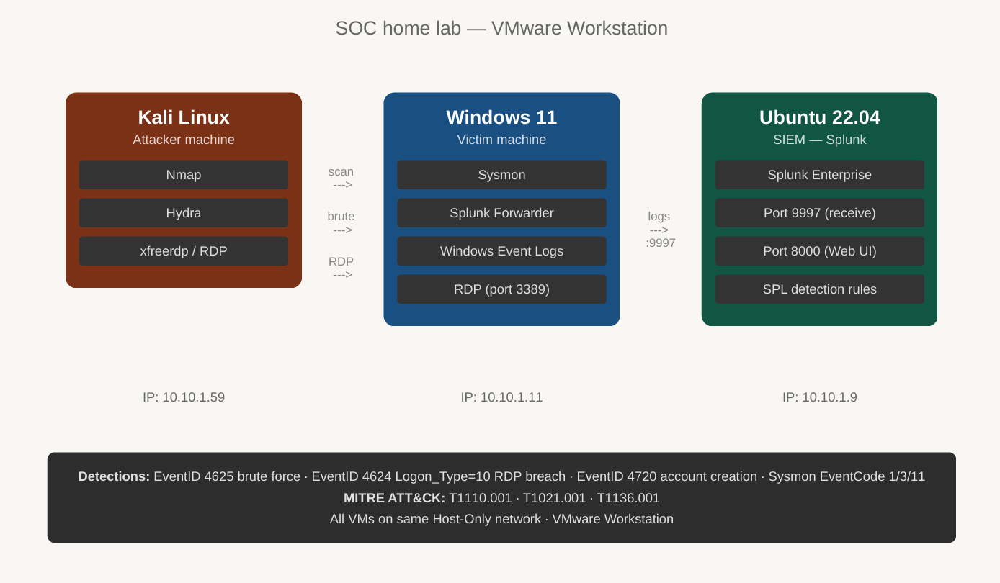
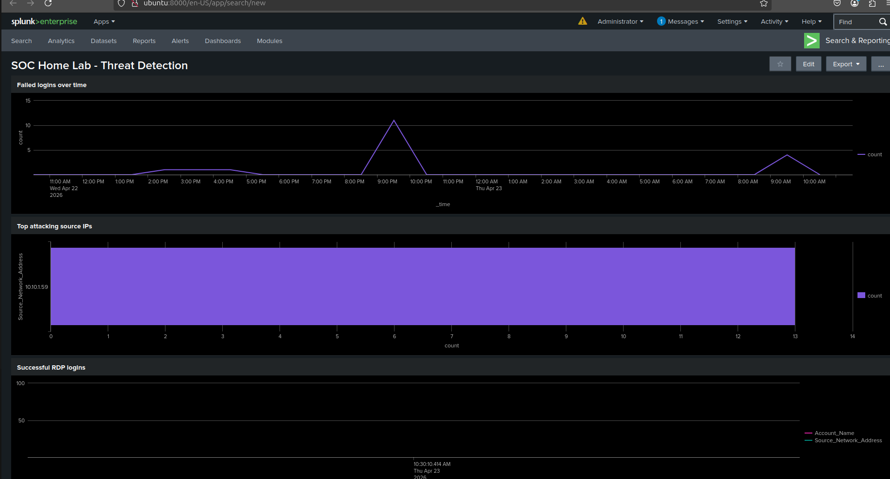
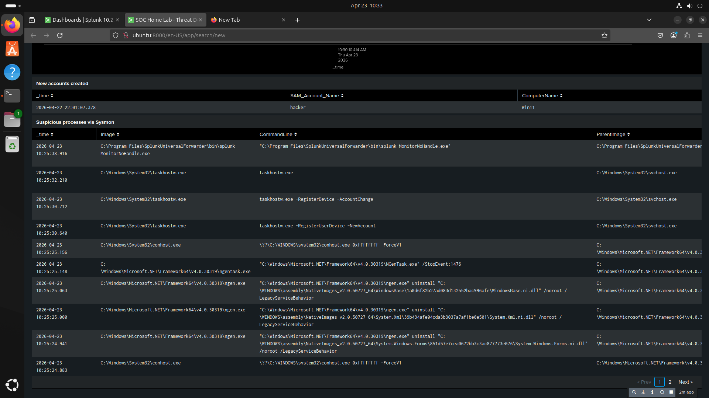
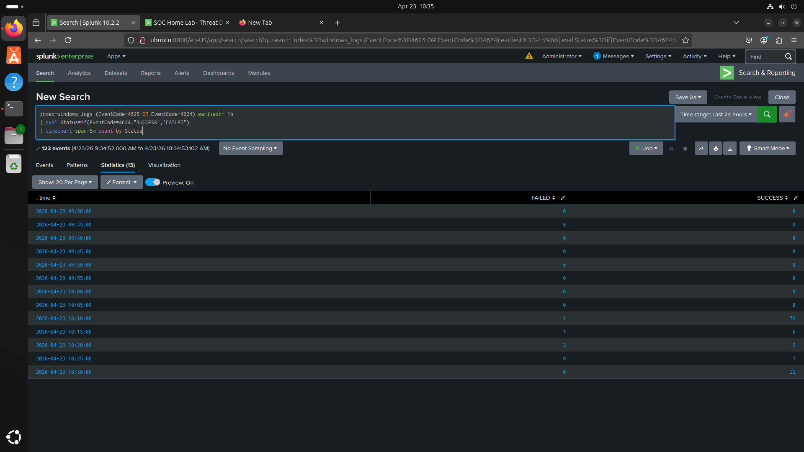

# SOC Home Lab — Threat Detection with Splunk

A 3-VM cybersecurity home lab simulating a real SOC environment.
Kali Linux attacks Windows 11, Splunk on Ubuntu detects and alerts.

## 🔥 Attack Scenario (End-to-End)

1. Attacker launched brute force attack using Hydra
2. Multiple failed logins detected (EventID 4625)
3. Successful RDP login (EventID 4624)
4. Persistence established (EventID 4720)
5. Splunk triggered alert → Incident response executed

## Architecture

| VM | Role | IP |
|---|---|---|
| Kali Linux | Attacker | 10.10.1.59 |
| Windows 11 | Victim + Sysmon | 10.10.1.11 |
| Ubuntu 22.04 | Splunk SIEM | 10.10.1.9 |

## Tools used

Splunk Enterprise · Sysmon (SwiftOnSecurity config) ·
Splunk Universal Forwarder · Nmap · Hydra · xfreerdp ·
VMware Workstation · MITRE ATT&CK Navigator

## Attack scenarios simulated

| Attack | Tool | Splunk Detection |
|---|---|---|
| Port scan | Nmap | Sysmon EventCode=3 |
| RDP brute force | Hydra | EventID 4625 ≥5 failures |
| Successful RDP breach | xfreerdp | EventID 4624 Logon_Type=10 |
| Backdoor account creation | net user | EventID 4720 |

## Splunk dashboard

##Splunk dashboard continuous

## Attack chain detected — brute force to breach

## MITRE ATT&CK mapping

| Technique | ID |
|---|---|
| Brute Force: Password Guessing | T1110.001 |
| Remote Services: RDP | T1021.001 |
| Create Account: Local Account | T1136.001 |

## Repo structure

- `splunk-queries/` — all SPL detection queries used
- `incident-reports/` — formal incident report INC-LAB-001
- `Screenshots/` — dashboard, alerts, attack chain evidence
- `architecture/` — lab diagram
- `configs/` — inputs.conf for Splunk Forwarder
